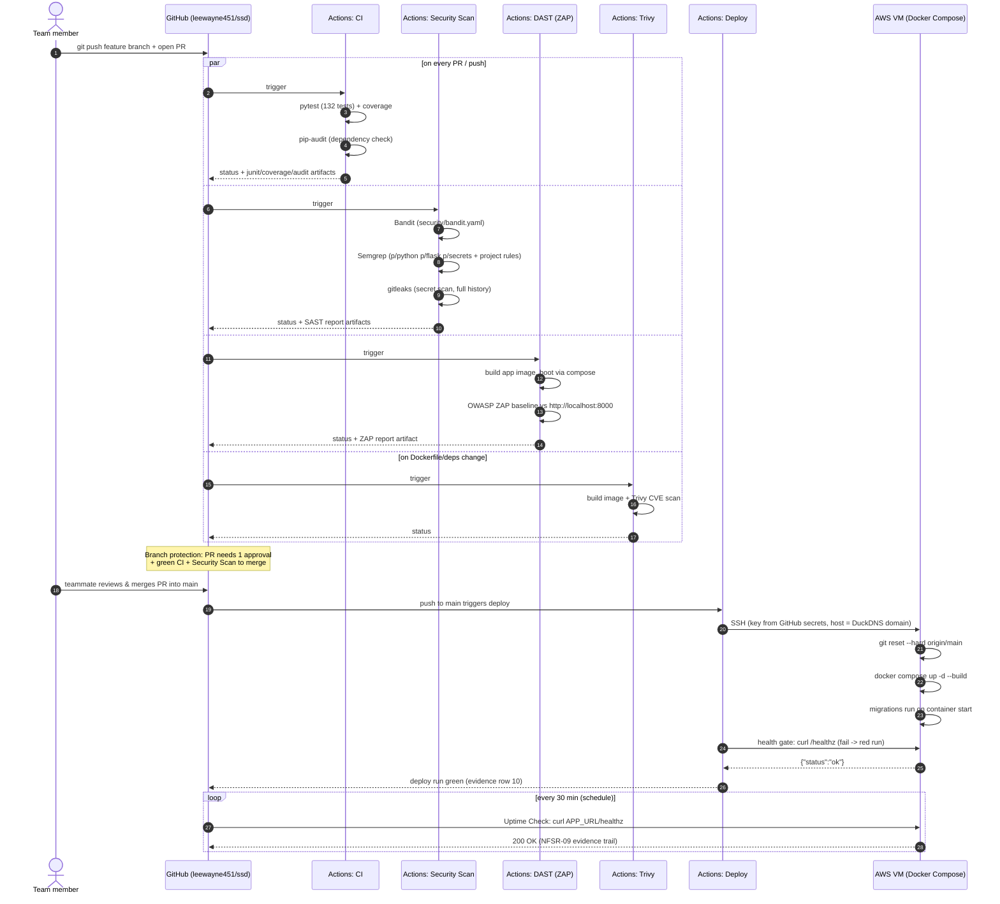

# CI/CD Pipeline — Sequence Diagram (D2 report §2.1)

Evidence row 17. Render with any mermaid viewer (GitHub renders it natively);
export to PNG for the report.

**Tools named for report §2.1:** GitHub Actions, pytest, coverage, pip-audit,
Bandit, Semgrep, gitleaks, OWASP ZAP, Trivy, Docker/Compose, nginx, Gunicorn,
certbot/Let's Encrypt, DuckDNS.
